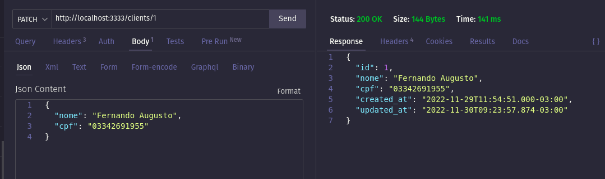

# API Restful. 

# Contexto
Este projeto trata-se de uma simples API Restful onde o cliente pode registrar usuário, realizar login, cadastrar, 
atualizar, listar e deletar  clientes, vendas e produtos no banco de dados MySql.


## Desenvolvimento 

> Backend
```bash
Feito em Node.js com o framework Adonis.js, TypeScript e o ORM Lucid. 

As requisições são recebidas pelo servidor, através dos endpoints criados para acesso no lado do cliente, 
então o servidor faz um redirecionamento para um router que passa para a camada de controller da aplicação 

Na camada de controller, recebemos os dados do cliente via body, params ou query, realizamos validações 
como: tipos de dados corretos, se são dados únicos, se o cliente possui token para verificar e conseguir
acessar as rotas disponíveis apenas para usuários. Caso haja algum erro nesse processo uma mensagem de 
erro será lançada. 

Estando tudo certo com os dados da requisição, se faz uma chamada da camada model que tem acesso ao banco 
de dados e recupera os dados requeridos retornando para o controller que passa para o cliente com o status
adequado e o corpo com o conteúdo dos dados. 

``` 

> Banco de dados
```bash
Feito com o banco de dados relacional MySql.O banco contará com as tabelas de produtos, clientes, endereços, 
usuários, produtos, vendas disponíveis. 
``` 

## Instalando Dependências

> Backend
```bash
Após clonar este repositório em seu diretório local, acesse a pasta onde foi clonado, 
então rode o comando npm install para instalar todos os pacotes. de back-end. Crie um arquivo
.env contendo suas credencias para acesso ao banco de dados e servidor. Dentro
do diretório existe o arquivo `.env.example` que serve como exemplo.
``` 

> Banco de dados
```bash
Após instalar back-end você poderá utilizar o arquivo `docker-compose.yml`
(caso você tenha Docker e Docker compose em sua máquina)  basta rodar o comando `docker-compose up` 
na pasta raíz, ou utilizar seu servidor MySql local. Certifique-se de não estar utilizando a `porta 3306`, 
pois ela será utilizada para rodar o servidor MySql.
``` 
## Executando aplicação

* Para rodar o servidor:

  ```
  Acesse a pasta raíz do projeto e rode `node ace serve --watch`. Certifique-se de não estar utilizando a `porta 3333`, 
  pois ela será utilzada para rodar o servidor Node.
  ```
* Para implementar as tabelas do banco de dados:

  ```
  Acesse a pasta raíz do projeto e rode `node ace migration:fresh`.
  
  
 ## Rotas 
 
 * Rota de registro (POST - /signup). Campos email e password obrigatórios. Exemplo:
 
 

 * Rota de login (POST - /login). Campos email e password obrigatórios. Exemplo:
 
  
 
 
 * Rota de registro de novo cliente (POST - /clients). Campos nome e cpf obrigatórios e token obrigatório. Exemplo:
 
 
 
 
  * Rota de listagem de clientes ordenados por ID (GET - /clients). Token no campo Authorization obrigatório. Exemplo:
  
  
 
 
  * Rota de listagem de cliente único e suas vendas por 'id', trazendo vendas mais recentes primeiro (GET - /clients/:id). ID e Token no campo Authorization obrigatório. Exemplo:
 
  
 

 * Rota atualiza cliente único e por 'id' (PATCH - /clients/:id). ID e campos para atualização e Token no campo Authorization obrigatórios. Exemplo:
 
  
 
 
 * Rota deleta cliente único e por 'id' (DELETE - /clients/:id). ID e Token no campo Authorization obrigatório. Exemplo:
 
  
 
 
  * Rota adciona novo produto(livro) (POST - /products). Campos nome, auto, editora, preço e Token no campo Authorization obrigatórios. Exemplo:
 
  
 
 
 * Rota atualiza produto(livro) por id (PATCH - /products/:id). ID, campos que serão atualizados e Token no campo Authorization obrigatórios. Exemplo:
 
  
 
 
  * Rota lista produto(livro) por id (GET - /products/:id).ID  e Token no campo Authorization obrigatórios. Exemplo:
 
  
 
 
  * Rota lista todos os produtos(livros) (GET - /products).Token no campo Authorization obrigatórios. Exemplo:
 
  


 * Rota de softdelete para produto(livro) por id (DELETE - /products/:id). ID e Token no campo Authorization obrigatórios. Exemplo:
 
  
  
  
